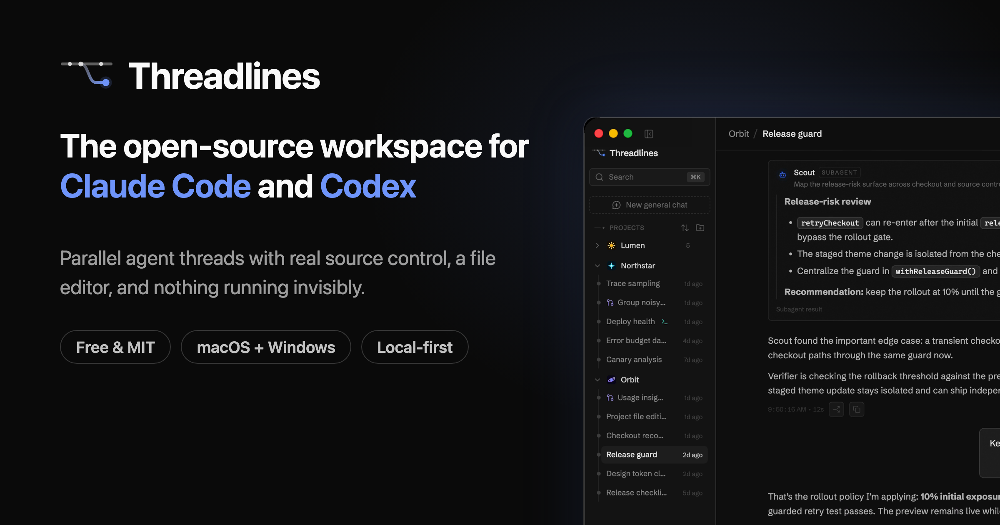

# Threadlines

<p align="center">
  
</p>

[](https://github.com/Threadlines/threadlines/actions/workflows/ci.yml)
[](https://github.com/Threadlines/threadlines/releases/latest)
[](./LICENSE)

Threadlines is a local-first desktop workspace for Codex and Claude Code.

It brings agent threads, terminals, diffs, branches, source-control workflows,
and session recovery into one focused app so coding agents stay manageable under
real project load.

The maintained provider paths are Codex and Claude. Other inherited provider
surfaces may remain while Threadlines narrows toward a smaller native desktop
surface.

## Installation

> [!WARNING]
> Threadlines uses locally installed coding agents. Install and authenticate at
> least one maintained provider before use:
>
> - Codex: install [Codex CLI](https://developers.openai.com/codex/cli) and run `codex login`
> - Claude: install [Claude Code](https://claude.com/product/claude-code) and run `claude auth login`

### Desktop app

Install the latest desktop alpha from
[GitHub Releases](https://github.com/Threadlines/threadlines/releases).

Signed Windows and macOS builds are published through the desktop release
workflow. Linux packaging exists locally but is not part of the normal release
lane yet.

### Server CLI

The npm package supports advanced CLI/server and remote-bootstrap usage:

```bash
npx @threadlines/server@latest --help
```

> [!IMPORTANT]
> The server requires **Node.js 22.22.2+, 24.15+, or 26+**. Odd-numbered Node
> releases are not supported.

### Local development

```bash
vp install --frozen-lockfile
vp run dev
```

On Windows, clone the repository **outside** OneDrive-synced folders
(Desktop/Documents by default) — syncing `node_modules`, `.git`, and build
output noticeably slows installs, builds, and file watching.

### Local desktop artifact

```powershell
vp install --frozen-lockfile
vp run dist:desktop:artifact -- --platform win --target nsis --arch x64 --build-version 0.2.0
```

The artifact is written to `release/`.

## Origins

Threadlines began as a fork of [T3 Code](https://github.com/pingdotgg/t3code).
It now has its own product direction, branding, desktop release pipeline,
provider orchestration, source-control workflow, signing/notarization setup, and
compatibility policy.

The upstream Git history and MIT attribution are kept intact.

See [docs/fork-separation.md](./docs/fork-separation.md) for the current origin
and compatibility policy.

## Configuration

New configuration should use `THREADLINES_*` environment variables:

- new local configuration should use `THREADLINES_*` environment variables;
- new installs default to a separate `~/.threadlines` data directory;
- the `threadlines` CLI is the supported command.

Usage analytics are enabled by default in official builds and can be disabled
from Settings. See [docs/telemetry.md](./docs/telemetry.md) for what Threadlines
collects and what it deliberately does not collect.

## Releases

Threadlines keeps the upstream Git history but uses its own app versions starting
at `0.0.1`.

See [docs/release.md](./docs/release.md) for the desktop release workflow,
platform status, signing requirements, and auto-update behavior.

## Development Notes

This is still early WIP. Expect sharp edges.

Do not commit `.env` files, tokens, private keys, local app data, customer data,
or screenshots containing secrets. See
[SECURITY_GUARDRAILS.md](./SECURITY_GUARDRAILS.md) before publishing code or
release artifacts.

Before local development, prepare the environment and install dependencies:

```bash
# Optional: only needed if you use mise for dev tool management.
mise install
vp install
```

Read [CONTRIBUTING.md](./CONTRIBUTING.md) before opening an issue or PR.

## Support development

Threadlines is free and open source. Optional sponsorships help cover ongoing
development and operating costs such as domains, code signing, CI, and hosted
Phone Link infrastructure. See [SUPPORT.md](./SUPPORT.md) for the no-perks
sponsorship policy and support channels.
