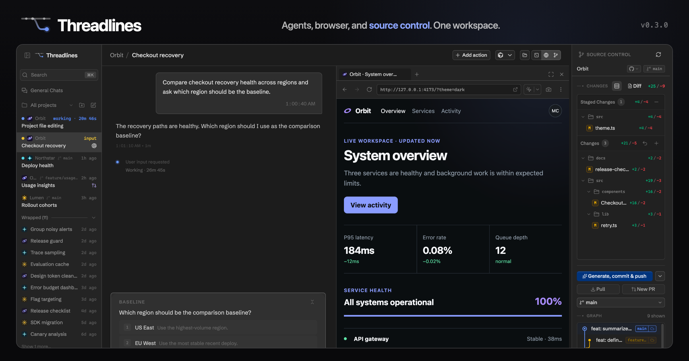

# Threadlines

<p align="center">
  
</p>

[](https://github.com/Threadlines/threadlines/actions/workflows/ci.yml)
[](https://github.com/Threadlines/threadlines/releases/latest)
[](./LICENSE)

**[Website](https://www.threadlines.dev/) · [Download](https://www.threadlines.dev/download/) · [What's new in v0.3](https://www.threadlines.dev/changelog/v0.3.0) · [Latest release](https://github.com/Threadlines/threadlines/releases/latest)**

Threadlines is an open-source desktop workspace for Codex and Claude Code. Keep
the agent conversation, a live browser, project files, terminal, and source
control open together so you can see, steer, and recover agent work without
reconstructing context across tools.

## Why Threadlines

- **A browser beside every thread.** Review visual changes and send the exact
  page state back to the agent without leaving the workspace.
- **Source control you can act on.** Inspect per-file changes and the commit
  graph, then commit, push, and open a pull request from the same app.
- **Exact context instead of repeated prompts.** Attach selected reply, code,
  or terminal lines directly to the next message.
- **Nothing runs invisibly.** Track tasks, subagents, and background processes,
  including their live state and stop controls.
- **Durable, provider-flexible sessions.** Resume work after restarts and switch
  between Codex and Claude Code without losing the thread or working tree.
- **Set up in minutes.** A first-run checklist installs the agent CLIs with one
  click and signs you in without leaving the app.
- **Your phone is a client.** Pair it with a QR code and check on running
  threads from anywhere, against the desktop app or a self-hosted server.
- **One usage picture across machines.** Token and cost dashboards read the
  agents' own transcripts on every computer you run, merged into one view.

## Installation

> [!NOTE]
> Threadlines drives locally installed coding agents:
> [Codex CLI](https://developers.openai.com/codex/cli) and
> [Claude Code](https://claude.com/product/claude-code). If they are missing,
> the first-run setup installs them with one click and signs you in without
> leaving the app. Installing them yourself beforehand works too.

### Desktop app

Install the latest stable desktop app from the
[download page](https://www.threadlines.dev/download/) or
[GitHub Releases](https://github.com/Threadlines/threadlines/releases/latest).

Signed Windows and macOS builds and a Linux x64 AppImage are published through
the desktop release workflow. Linux builds are unsigned; integrity for
auto-updates is verified through the updater manifest hashes.

Then open a local project and start a thread with the provider you already use.

### Self-host with Docker

Run Threadlines on a VPS or home server and connect from any browser or your
phone:

```bash
docker run -d --name threadlines --restart unless-stopped \
  -p 3773:3773 \
  -v threadlines-home:/home/threadlines \
  -v /path/to/your/repos:/workspace \
  ghcr.io/threadlines/threadlines:latest
```

See [docker/README.md](./docker/README.md) for the full guide, including phone
pairing and safe remote access.

### Server CLI

The npm package supports advanced CLI/server and remote-bootstrap usage:

```bash
npx @threadlines/server@latest --help
```

> [!IMPORTANT]
> The server requires **Node.js 22.22.2+, 24.15+, or 26+**. Odd-numbered Node
> releases are not supported.

### Local development

```bash
vp install --frozen-lockfile
vp run dev
```

On Windows, clone the repository **outside** OneDrive-synced folders
(Desktop/Documents by default) — syncing `node_modules`, `.git`, and build
output noticeably slows installs, builds, and file watching.

### Local desktop artifact

```powershell
vp install --frozen-lockfile
vp run dist:desktop:artifact -- --platform win --target nsis --arch x64 --build-version 0.3.0
```

The artifact is written to `release/`.

## Supported providers

Codex and Claude Code are the actively maintained providers today. Drivers for
other agents exist in the codebase, and support for more providers is open for
the future as the product grows.

## Origins

Threadlines began as a fork of [T3 Code](https://github.com/pingdotgg/t3code)
and has since grown its own product direction, branding, release pipeline,
provider orchestration, and source-control workflow. Upstream remains a source
of inspiration, and improvements flow back when they fit.

The upstream Git history and MIT attribution are kept intact.

See [docs/fork-separation.md](./docs/fork-separation.md) for the origins and
compatibility policy.

## Configuration

New configuration should use `THREADLINES_*` environment variables:

- new local configuration should use `THREADLINES_*` environment variables;
- new installs default to a separate `~/.threadlines` data directory;
- the `threadlines` CLI is the supported command.

Usage analytics are enabled by default in official builds and can be disabled
from Settings. See [docs/telemetry.md](./docs/telemetry.md) for what Threadlines
collects and what it deliberately does not collect.

## Releases

Threadlines keeps the upstream Git history but uses its own app versions starting
at `0.0.1`.

See [docs/release.md](./docs/release.md) for the desktop release workflow,
platform status, signing requirements, and auto-update behavior.

## Development Notes

This is still early WIP. Expect sharp edges.

Do not commit `.env` files, tokens, private keys, local app data, customer data,
or screenshots containing secrets. See
[SECURITY_GUARDRAILS.md](./SECURITY_GUARDRAILS.md) before publishing code or
release artifacts.

Before local development, prepare the environment and install dependencies:

```bash
# Optional: only needed if you use mise for dev tool management.
mise install
vp install
```

Read [CONTRIBUTING.md](./CONTRIBUTING.md) before opening an issue or PR.

## Support development

Threadlines is free and open source. Optional sponsorships help cover ongoing
development and operating costs such as domains, code signing, CI, and hosted
Phone Link infrastructure. See [SUPPORT.md](./SUPPORT.md) for the no-perks
sponsorship policy and support channels.
